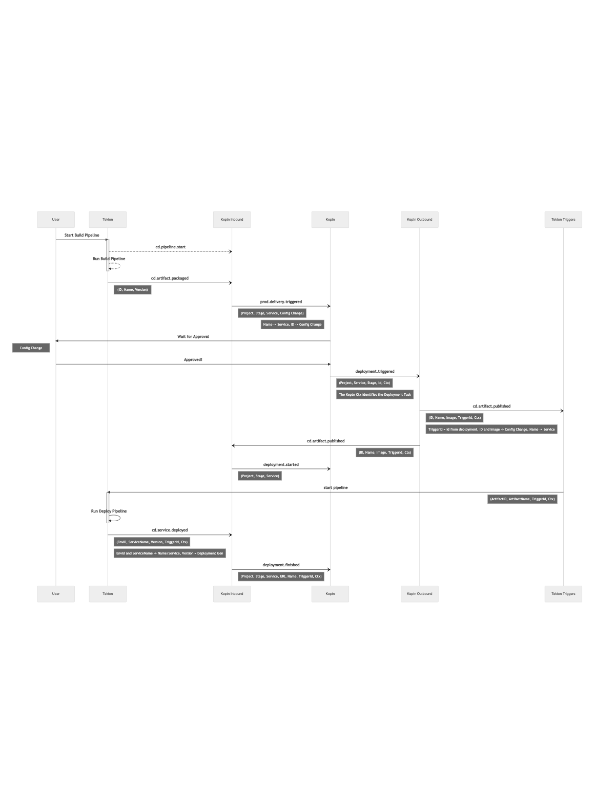

# CDF SIG Events Protocol Proof of Concept

The SIG Events will advance the [specification of its protocol](https://github.com/cdfoundation/sig-events/blob/main/vocabulary-draft/introduction.md) (a.k.a. "CD Events")
and the development of the SDK with the help a proof of concept (PoC).

The PoC and related material will help raising questions and motivating
decisions; it will be beneficial to the SIG in presentations about the
work that the SIG Events is doing.

## PoC Overview

The proof of concept showcases interaction between [Tekton](https://tekton.dev)
and [Keptn](https://keptn.sh/), using the CD Events specification being worked on by
the [Events Special Interest Group](https://github.com/cdfoundation/sig-events)
part of the [Continuous Delivery Foundation](https://cd.foundation/) (CDF).

Tekton is an open-source framework for creating CI/CD systems, and is a CDF
founding project.

Keptn is an open-source cloud-native application life-cycle orchestration
solution and is a [Cloud-Native Computing Foundation](https://www.cncf.io/)
Sandbox project.

The PoC uses the CDF SIG Events Protocol [Go library/CLI](https://github.com/cdfoundation/sig-events/tree/main/cde/sdk/go)
to produce and send events.

### Purpose of the PoC

The two primary purposes of the PoC is one, as mentioned above,
to help the work of SIG Events, and two, to show an indication of the
power of having individually strong projects such as Tekton and Keptn
collaborating to provide even more value.

In the PoC some shortcuts will be taken, for instance there will be no
true native communication between Tekton and Keptn, some translation
layers will be used. It is important to note, however, that the PoC is
being developed with active participation from the Tekton and Keptn
communities, so native communication is already on the agenda for
post-PoC work.

### PoC Use Case

The use case showcased by the PoC can be summarized as follows:

1. A new version of a container is built by Tekton.
2. Keptn is informed by this new build.
3. Keptn decides what to do next following its orchestration manifest.
4. Keptn sends out a request for the next operation to be started.
   (In the PoC, the next operation will be deployment of the container.)
5. Tekton recieves the request and runs the deployment operation.
6. Keptn is informed that the operation is completed.

### PoC modules and interactions

An overview of the modules and interactions can be seen in the following diagram:

Going from top to bottom in the diagram:

* At the top, we have **Tekton** without modifications.
  Tekton runs the build and deploy operations for the described use case above.
* Just below, we have an experimental **[Tekton CloudEvents controller](https://github.com/tektoncd/experimental/tree/main/cloudevents)**.
  The controller creates CD Events from Tekton internal signals.
* Next, we have the **CD Events Go library/CLI** which provides both the encoding
  and transmission of CD Events following the specification.
* The Go library/CLI internally uses the **[CloudEvents Go SDK](https://github.com/cloudevents/sdk-go)**
  to create and send events.
* Next to Keptn, we have two modules, one for incoming and one for outgoing Keptn events.
  * The **[Keptn translation](https://github.com/salaboy/keptn-cdf-translator)** module translates from CD Events
  to Keptn native events.
  * The **[Keptn service](https://github.com/salaboy/cdf-events-keptn-adapter)** module creates CD Events from Keptn internal signals.
* Finally, we have **Keptn** itself, orchestrating the life-cycle operations for the use case above.

