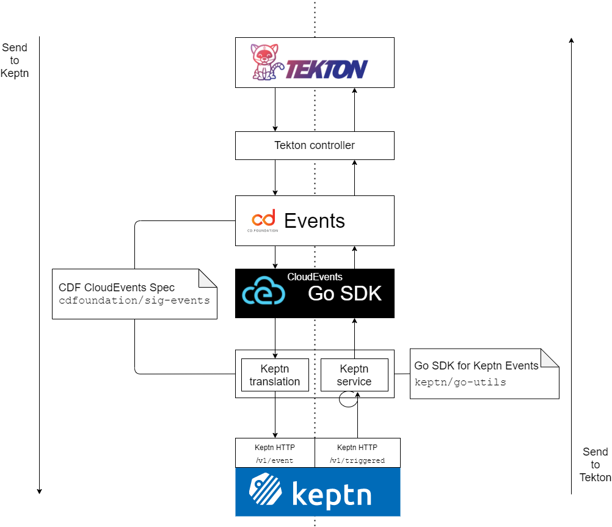

# CDF SIG Events Protocol Proof of Concept

The SIG Events will advance the specification of its protocol and the
development of the SDK with the help a proof of concept (PoC).

The PoC and related material will help raising questions and motivating
decisions; it will te beneficial to the SIG in presentations about the
work that the SIG Events is doing.

## High Level Diagram

